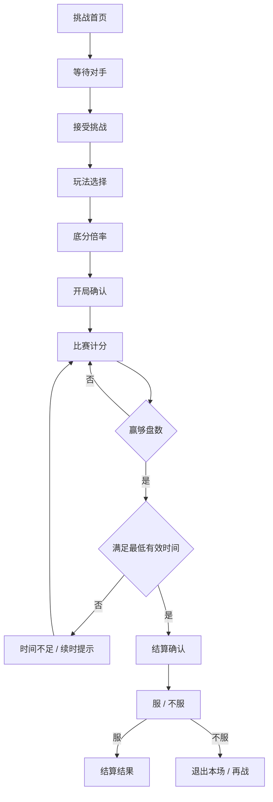

# 球友端多页面递进流程规格

状态：v1.0
日期：2026-05-27
用途：约束微信小程序球友端页面拆分，避免把所有功能堆到一个长页面。

## 1. 纠偏结论

`pages/player/player` 这种“把玩法、底分、计分、结算、排行榜全部串在一个页面里”的做法是错误方向。

球友端必须按真实挑战流程拆成多个页面：

- 一页只保留一个主要任务。
- 页面之间层层递进。
- 比赛开始后不展示底部 Tab，减少误触。
- UI Kit 页面只用于组件验收，不等于真实业务页面。
- 业务页面只展示正式上线会出现的内容；内部校验、PM 说明、演示状态、mock、模拟、调试、临时、占位说明不得外显。

## 2. 页面流程

## 3. 页面清单

| 顺序 | 路由 | 页面 | 主任务 | 是否显示底部 Tab |
| ---: | --- | --- | --- | --- |
| 1 | `pages/challenge-home/challenge-home` | 挑战首页 | 开始或加入挑战 | 是 |
| 2 | `pages/waiting-room/waiting-room` | 等待对手 | 等对方扫码进入 | 否 |
| 3 | `pages/accept-challenge/accept-challenge` | 接受挑战 | 乙方决定是否加入 | 否 |
| 4 | `pages/mode-select/mode-select` | 玩法选择 | 只选抢 5 / 抢 7 / 抢 10 预留 | 否 |
| 5 | `pages/points-select/points-select` | 底分倍率 | 只选底分和倍率 | 否 |
| 6 | `pages/match-confirm/match-confirm` | 开局确认 | 看懂风险积分和随机奖励 | 否 |
| 7 | `pages/match-scoring/match-scoring` | 比赛计分 | 只记录盘数和看时间状态 | 否 |
| 8 | `pages/time-insufficient/time-insufficient` | 时间不足 | 提示继续打或续时 | 否 |
| 9 | `pages/settlement/settlement` | 结算确认 | 看清积分、奖励、加星 | 否 |
| 10 | `pages/refusal/refusal` | 不服二选一 | 退出本场或再战 | 否 |
| 11 | `pages/match-result/match-result` | 结算结果 | 展示结算仪式和下一步 | 否 |
| 12 | `pages/my-data/my-data` | 我的数据 | 查看个人成长 | 是 |
| 13 | `pages/rankings/rankings` | 排行榜 | 看店内总榜、同段位榜、好友榜 | 是 |
| 14 | `pages/points-perks/points-perks` | 积分礼遇 | 查看积分和前台兑换说明 | 是 |

## 4. 每页信息约束

| 页面 | 必须展示 | 不应展示 |
| --- | --- | --- |
| 挑战首页 | 门店、球桌、到点时间、当前段位、当前积分、开始挑战 | 底分倍率、比赛计分、结算明细 |
| 等待对手 | 房间状态、球桌、甲方信息、退出 | 玩法选择、排行榜 |
| 接受挑战 | 发起人、球桌、接受 / 拒绝 | 底分倍率、积分公式 |
| 玩法选择 | 抢 5、抢 7、抢 10 预留、最低时间、加星收益 | 底分倍率、计分器 |
| 底分倍率 | 底分档位、倍率档位、风险积分公式 | 比分、排行榜 |
| 开局确认 | 双方、玩法、风险积分、普通随机奖励、续时冲刺奖励 | `+ / -` 计分 |
| 比赛计分 | 大比分、`+ / -`、正向计时、最低有效时间、可否清算 | 排行榜、积分兑换 |
| 时间不足 | 已进行时间、最低时间、到点续时提醒、继续打 | 结算确认按钮 |
| 结算确认 | 胜方、比分、风险积分、随机奖励、双方积分变化、加星 | 玩法重新选择 |
| 不服二选一 | 退出本场、再战 | 积分生效状态 |
| 结算结果 | 加分/扣分、随机奖励、加星、返回首页/再来一局 | 参数选择 |

## 4.1 挑战首页上线级要求

挑战首页不是玩法说明页，也不是所有功能的入口集合。上线版首页只做一件事：判断当前用户是否具备发起有效积分挑战的条件。

必须有：

- 门店名、球桌号、开台到点时间。
- 当前段位卡，并说明全部游戏模式共用一个段位。
- 内部开局门槛：微信登录、店内 100 米定位、球桌开台有效。
- 前台只展示“排位可用 / 暂不可用”和发起挑战按钮，不直接展示内部检查清单。
- 主按钮跟内部门槛联动；条件不满足时不能进入等待房间，并给出用户能理解的处理提示。
- 顾客能自然理解下一步是发起挑战、等待对手加入。

不能有：

- 首页直接选择底分和倍率。
- 首页直接展示比赛计分器。
- 首页直接展示结算明细。
- 用长规则文案填满首屏。
- 展示 `FLOW`、`本页只做入口`、`已完成`、`待处理` 这类演示 / PM / 调试痕迹。
- 把微信登录、定位、球桌开台拆成清单给顾客看。

## 4.2 等待与接受挑战上线级要求

等待页必须像真实房间状态页：

- 展示房间码、球桌号、发起人、等待状态。
- 用户可执行动作只能是刷新状态、取消挑战等正式动作。
- 后端未接入时不能出现“模拟对手扫码”“当前 mock”这类演示文案。
- 不展示玩法、底分、倍率、排行榜。

接受挑战页必须像真实邀请确认页：

- 展示发起方、挑战方、球桌、房间状态。
- 只提供接受挑战、拒绝邀请。
- 接受后进入玩法选择；拒绝后返回首页。
- 不提前展示底分倍率、积分公式和结算规则。

## 4.3 玩法与风险积分上线级要求

玩法选择、底分倍率、开局确认必须是一条真实参数链：

- 玩法页选择的 `modeId` 必须传到后续页面。
- 底分页选择的底分、倍率、风险积分必须传到开局确认页。
- 开局确认页展示用户真实选择后的参数，不读取固定演示参数。
- 用户可见文案不能出现“本页只选”“后台模板”“服务器记录”等实现说明。
- 抢 10 未开放时可展示为“暂未开放”，但不能写成内部后台预留说明。

## 4.4 比赛计分与时间规则上线级要求

比赛计分页必须按真实比赛状态工作：

- 从开局确认页接收玩法、底分、倍率、风险积分。
- 正向计时从 `00:00:01` 开始累计。
- 双方都可以加减盘数。
- 任一方达到目标盘数后，先检查最低有效时间。
- 未满最低有效时间时进入时间不足页，不能进入结算。
- 时间不足页只能提供继续计分、先去续时等正式动作，不能提供“演示进入结算”。

## 4.5 结算、服 / 不服与结果页上线级要求

结算页必须接收前面流程产生的本场参数：

- 玩法、底分、倍率、风险积分、比分、赢家、已用时间必须从比赛流程传入。
- 赢家积分变化 = 风险积分 + 本场随机奖励。
- 输家积分变化 = 本场随机奖励 - 风险积分。
- 随机奖励使用同一套标准，双方同享，不再拆胜方奖励和败方奖励。
- 结算页必须明确展示胜方、比分、风险积分、随机奖励、双方积分变化、胜方加星。
- “服了”才进入结算结果页；“不服”进入退出本场 / 再战选择页。

不服页必须只做两种正式动作：

- 双方同意退出本场：本场不计积分、不加星。
- 再战一场：当前场作废，重新选择玩法、底分和倍率。

结果页必须展示结算已经生效后的反馈：

- 胜方最终加分、败方最终扣分或少量变化。
- 本场随机奖励。
- 胜方加星。
- 下一步只保留再来一局、回到首页等正式动作。

不能有：

- 固定旧结算数据。
- “模拟结算”“演示生效”“测试随机奖励”等演示文案。
- 把“不服”后的积分生效状态作为说明卡展示。

## 4.6 数据、排行榜、积分礼遇上线级要求

我的数据页必须像真实个人中心：

- 展示当前段位、当前积分、星级进度。
- 展示本赛季胜率、有效挑战数、当前连胜。
- 展示店内排名、同段位排名、好友排名摘要。
- 不出现“个人端说明”“MVP”“后续接真实数据”等产品说明文案。

排行榜页必须支持三类榜单：

- 店内总榜。
- 同段位榜。
- 微信好友榜。

排行榜页不能写“后续切换”“后续接入”等开发说明；即使数据暂时是占位，也必须按真实榜单状态展示。

积分礼遇页必须按顾客可理解的方式展示：

- 当前积分。
- 兑换门槛。
- 开台赠分。
- 前台兑换方式。

积分礼遇页不能出现“老板后台可调”“MVP 不做线上商城”“后续维护”等内部说明。这些配置口径只允许放在 PRD、老板端或文档里。

## 5. 实现约束

- `pages/ui-kit/ui-kit` 只作为仓库内组件验收台，不能放进正式 `app.json` 页面列表。
- 真实首屏必须是 `pages/challenge-home/challenge-home`。
- 错误长页 `pages/player/player` 不再作为业务入口。
- 共享本地数据先放在 `miniprogram/utils/ladder-data.js`，后续替换成接口数据。
- 页面间先用 `wx.navigateTo` 串流程，后续接真实房间状态机。
- 比赛中页面不放底部 Tab，只保留返回/退出类弱入口。
- 每完成一轮页面重构，必须同步 `docs/dev-log.md` 和任务台账。
- 后端未接入时允许使用占位数据，但页面文案和布局必须按正式上线态设计，不能出现演示按钮或模拟说明。
