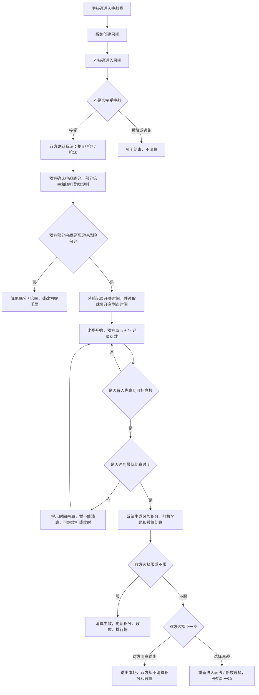

# 01. 目标、角色与完整流程

> 返回：[方案导航](../ladder-simple-operation-plan.md)

## 1. 核心目标

这个小程序第一版只解决一个问题：

**让球友到店后可以很快开一场挑战赛，系统自动算积分、算段位、更新排行榜，同时用时间门槛、随机奖励和榜单荣誉把顾客留在桌上。**

不做复杂积分商城，不做复杂任务，不做复杂抽奖，不做自动陌生人匹配。

## 2. PPT 里提取到的流程

`台球小程序.pptx` 一共 6 页，核心流程如下：

1. 甲扫码进入挑战赛首页，等待对手进入房间。
2. 乙扫码进入后，看到「甲对你发起挑战」，可选择接受挑战、投降、逃跑。
3. 乙接受后，甲选择玩法，例如中八抢五、抢七、抢十。
4. 双方确认挑战底分和积分倍率，同时看到风险积分和系统随机奖励规则。
5. 比赛开始后，页面显示甲乙分数，支持 `+` / `-` 记录盘数。
6. 达到胜利盘数后，系统结算；败方选择「服」或「不服」。

PPT 里有些参数写的是 30 分钟，但本方案以合伙人最新口述为准：

- 抢 5：40 分钟后才能清算。
- 抢 7：1 小时 20 分钟后才能清算。
- 抢 10：1 小时 40 分钟后才能清算，第一版可作为预留 / 可开放模式。
- 抢 9：不开放，因为台球项目里没有抢 9 这种常见玩法。

## 3. 第一版用户角色

### 3.1 球友

球友只需要做这些事：

- 扫码进入房间。
- 接受或拒绝挑战。
- 选择玩法、挑战底分和积分倍率。
- 开局前确认风险积分、普通随机奖励和续时冲刺奖励。
- 比赛中点击 `+` / `-` 记录自己和对方赢了几盘。
- 比赛结束后确认「服」或「不服」。
- 查看积分、段位、店内总榜、同段位榜、微信好友榜。
- 所有游戏模式共用一个个人段位，不需要理解不同模式的独立段位。

### 3.2 员工

员工负责简单管理：

- 设置球桌开台到点时间。
- 核验顾客是否在店内有效开台。
- 必要时帮顾客发起比赛。
- 处理异常比赛。
- 前台兑换时扣除顾客积分。

### 3.3 老板

老板负责配置参数：

- 全部玩法参数：时间门槛、挑战底分档位、积分倍率、普通随机奖励、续时冲刺奖励。
- 全部积分参数：新人初始积分、到店登录积分、开台赠送积分、兑换门槛；所有数值老板可调。
- 段位清算规则。
- 全部游戏模式共用一个段位；不同模式只配置加星 / 掉星差异。
- 个人端排行榜和电视排行榜展示规则。

## 4. 挑战赛完整流程

