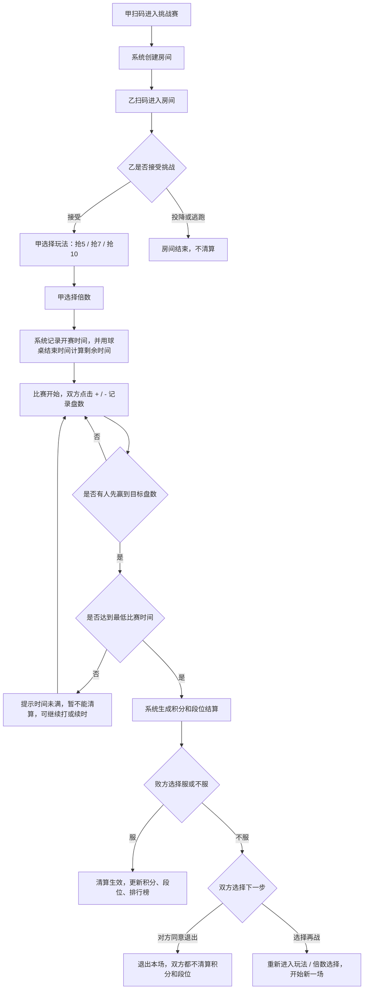

# 台球厅微信小程序「简单天梯挑战」方案

版本：讨论稿 v0.2  
日期：2026-05-24  
资料来源：合伙人口述新规则 + `台球小程序.pptx`  
当前最高原则：**机制要简单，操作要简单。**

> 说明：2026-05-23 的复杂段位、商城、抽奖、任务体系方案全部作废。  
> 当前方案只围绕「扫码挑战、选择玩法、选择倍数、记录盘数、到时间后清算积分和段位、电视排行榜」来设计。

## 1. 核心目标

这个小程序第一版只解决一个问题：

**让球友到店后可以很快开一场挑战赛，系统自动算积分、算段位、更新排行榜，同时用时间门槛和随机奖励把顾客留在桌上。**

不做复杂积分商城，不做复杂任务，不做复杂抽奖，不做自动陌生人匹配。

## 2. PPT 里提取到的流程

`台球小程序.pptx` 一共 6 页，核心流程如下：

1. 甲扫码进入挑战赛首页，等待对手进入房间。
2. 乙扫码进入后，看到「甲对你发起挑战」，可选择接受挑战、投降、逃跑。
3. 乙接受后，甲选择玩法，例如中八抢五、抢七、抢十。
4. 甲选择倍数，例如一倍、两倍、三倍、四倍。
5. 比赛开始后，页面显示甲乙分数，支持 `+` / `-` 记录盘数。
6. 达到胜利盘数后，系统结算；败方选择「服」或「不服」。

PPT 里有些参数写的是 30 分钟，但本方案以合伙人最新口述为准：

- 抢 5：40 分钟后才能清算。
- 抢 7：1 小时 30 分钟后才能清算。
- 抢 10：预留 / 可开放模式，参数由老板配置。
- 抢 9：不开放，因为台球项目里没有抢 9 这种常见玩法。

## 3. 第一版用户角色

### 3.1 球友

球友只需要做这些事：

- 扫码进入房间。
- 接受或拒绝挑战。
- 选择玩法和倍数。
- 比赛中点击 `+` / `-` 记录自己和对方赢了几盘。
- 比赛结束后确认「服」或「不服」。
- 查看积分、段位、排行榜。

### 3.2 员工

员工负责简单管理：

- 设置球桌结束时间。
- 必要时帮顾客发起比赛。
- 处理异常比赛。
- 前台兑换时扣除顾客积分。

### 3.3 老板

老板负责配置参数：

- 每种玩法的时间门槛。
- 每盘基础分。
- 可选倍数。
- 系统奖励分。
- 随机奖励规则。
- 段位清算规则。
- 电视排行榜展示规则。

## 4. 挑战赛完整流程



## 5. 玩法模板

所有玩法都做成「模板」，老板和员工可以配置，但用户只看到简单选项。

### 5.1 默认玩法表

| 玩法 | 胜利条件 | 最低清算时间 | 每盘基础分 | 默认倍数 | 系统固定奖励 |
| --- | --- | ---: | ---: | --- | ---: |
| 中八抢 5 | 先赢 5 盘 | 40 分钟 | 10 分 | x1 / x2 / x3 | 每人 +5 |
| 中八抢 7 | 先赢 7 盘 | 90 分钟 | 20 分 | x1 / x2 / x3 / x4 | 可配置，建议每人 +5 |
| 中八抢 10 | 先赢 10 盘 | 可配置 | 可配置，建议高于抢 7 | 可配置 | 可配置 |

第一版建议：

- 先开放抢 5 和抢 7。
- 抢 10 可以作为预留模板或后续开放玩法。
- 抢 9 不开放，因为台球项目里没有抢 9 的常见玩法。
- 玩法奖励分数随着抢的局数增加而递增，但具体数值由管理员设置，不写死。

### 5.2 参数配置规则

老板可配置：

- 玩法名称。
- 胜利盘数。
- 最低清算时间。
- 每盘基础分。
- 允许倍数。
- 倍数上限。
- 系统固定奖励。
- 不同玩法的奖励分数。
- 是否开启随机奖励。
- 开台剩余时间小于 30 分钟时，是否自动提高奖励分数。
- 剩余时间奖励倍率或奖励区间。
- 是否计入段位。

员工可配置：

- 当场选择或修正玩法。
- 当场设置或修正球桌结束时间。
- 当场处理异常或争议。

建议限制：

- 员工不能随便新增玩法。
- 员工不能超过老板设置的倍数上限。
- 员工所有修改都要留操作日志。

## 6. 积分清算规则

### 6.1 术语建议

前台可以继续叫「倍数」，但尽量不要在页面上写「赔率」。

原因：

- 「赔率」容易让用户联想到押注或博彩。
- 「倍数」更像游戏奖励倍率，也更安全。

### 6.2 推荐积分公式

第一版用最简单、用户容易心算的公式：

```text
个人本场积分 = 自己赢的盘数 × 每盘基础分 × 倍数 + 系统固定奖励 + 随机奖励
```

示例 1：

- 玩法：抢 5。
- 每盘基础分：10 分。
- 倍数：x2。
- 甲 5:3 赢乙。
- 系统固定奖励：每人 +5。

则：

- 甲积分 = 5 × 10 × 2 + 5 = 105 分。
- 乙积分 = 3 × 10 × 2 + 5 = 65 分。

示例 2：

- 玩法：抢 7。
- 每盘基础分：20 分。
- 倍数：x3。
- 甲 7:5 赢乙。
- 系统固定奖励：每人 +5。

则：

- 甲积分 = 7 × 20 × 3 + 5 = 425 分。
- 乙积分 = 5 × 20 × 3 + 5 = 305 分。

### 6.3 为什么这样算

这样设计有三个好处：

- 用户很容易理解：赢几盘、每盘多少分、乘几倍。
- 败方也有积分：输了也不至于完全没收益，愿意继续打。
- 不需要做复杂任务和商城：积分只作为球房权益凭证。

### 6.4 积分兑换方式

积分页面第一版不做复杂互动。

球友端只展示：

- 当前积分。
- 积分明细。
- 可兑换项目说明。
- 提示「请到前台兑换」。

前台员工端做：

- 搜索用户。
- 查看积分余额。
- 扣除积分。
- 填写兑换备注。

这样最简单，也符合线下球房的操作习惯。

## 7. 段位清算规则

段位清算也要简单，第一版不要和积分倍数绑得太复杂。

推荐默认：

| 结果 | 段位变化 |
| --- | --- |
| 青铜到黄金 | 胜方 +1 星，败方不掉星 |
| 黄金以后 | 胜方加星，败方可能掉星 |
| 黄金以后败方 0 星 | 是否降段由老板配置 |
| 争议或不服 | 不清算段位 |

建议：

- 倍数只影响积分，不影响段位。
- 不要因为 x3 就让胜方 +3 星，否则段位很快失控。
- 青铜到黄金之间只做正反馈，不掉星，降低新手挫败感。
- 黄金以后开放掉星，具体小段位、加星、掉星规则等合伙人明天补充。
- 将来如果要做刺激玩法，可以新增「高倍挑战模式」，但第一版先不做。

段位结构可以先简单：

- 青铜
- 白银
- 黄金
- 铂金
- 钻石
- 星耀
- 王者

每个段位需要几颗星，由老板后台配置。

## 8. 时间门槛规则

### 8.1 为什么要有时间门槛

时间门槛不是怕顾客打得少，而是防止刷分。

例如抢 5 要求 40 分钟：

- 如果 20 分钟就打完 5:0，系统不立即清算。
- 页面提示：比赛时间未满 40 分钟，暂不能清算。
- 用户可以继续打、练球、加赛或续时。
- 到 40 分钟后，才能确认清算。
- 比赛超过 40 分钟没有问题，因为 40 分钟是最短有效时长，不是最长时长。
- 计时必须从 `00:00:01` 开始正向累计，不能从 40 分钟往 0 倒计时。

### 8.2 时间以什么为准

以小程序后端服务器时间为准，不以用户手机时间为准。

每场比赛记录：

- 开赛时间。
- 当前玩法最低清算时间。
- 目标盘数达成时间。
- 实际清算时间。

清算条件必须同时满足：

1. 有人先赢到目标盘数。
2. 距离开赛时间达到玩法要求，例如抢 5 满 40 分钟。

页面展示建议：

- 显示「已进行 12:35」这种正向计时。
- 显示「最低有效时间 40:00」。
- 显示「还差 27:25 可清算」。
- 不显示一个从 40:00 倒数到 00:00 的倒计时，避免顾客误以为比赛超时会作废。

### 8.3 时间不足时的页面提示

例如抢 5 只打了 25 分钟就达成 5 盘：

页面提示：

> 已达到胜利盘数，但本场未满 40 分钟，暂不能清算。  
> 还差 15 分钟，可继续练习、加赛或到前台续时。

按钮：

- 继续记录。
- 等待到点。
- 找员工处理。

### 8.4 开台剩余时间不足时

如果球桌开台剩余时间已经少于当前玩法的最低清算时间，本场可以继续打，但默认不计入积分和段位。

例如：

- 抢 5 最低有效时间是 40 分钟。
- 当前球桌只剩 30 分钟。
- 即使双方在 30 分钟内打完 5 盘，也不满足最低 40 分钟要求。
- 本场不能积分结算，也不能段位结算。
- 系统不支持把这 30 分钟「存起来」下次继续补时间。

页面提示建议：

> 当前球桌剩余时间不足 40 分钟，本场可作为娱乐局继续进行，但不能计入积分和段位。  
> 如需计入挑战赛，请先到前台续时。

按钮：

- 继续娱乐局。
- 去前台续时。
- 退出本场。

## 9. 球桌剩余时间和随机奖励

### 9.1 想实现的效果

如果某张桌剩余时间不多，例如只剩 30 分钟，系统可以给更高的每盘随机奖励，刺激顾客继续打或续时。

这相当于：

- 桌快到时间了，系统给一点奖励刺激。
- 顾客为了拿奖励和完成清算，会更愿意续时。
- 球房台时收入被拉长。

### 9.2 没有开台软件 API 时，用「结束时间法」

如果现有开台软件不提供 API、小程序无法读取它的数据库，也没有导出接口，那么小程序无法可靠知道真实剩余时间。

不要一开始做复杂抓屏、OCR、外挂读取数据库。这些方案容易坏，也不够稳。

第一版推荐最简单方案：

**员工只设置球桌结束时间，小程序自动计算比赛开始时的剩余时间。**

流程：

1. 员工在现有开台软件里正常开台。
2. 员工在小程序员工端选择球桌。
3. 输入或选择该桌「结束时间」，例如 21:30。
4. 顾客开挑战赛时，小程序记录服务器开赛时间。
5. 系统自动计算：球桌剩余时间 = 球桌结束时间 - 比赛开始时间。
6. 续时后，员工只需要把球桌结束时间往后改，例如从 21:30 改为 22:30。

为了减少员工操作，可以加一个确认弹窗：

> 当前记录：3 号桌结束时间 21:30。现在开赛，剩余 28 分钟。是否正确？

员工只需要点：

- 正确。
- 修改。

这个方案比手动填剩余分钟更好，因为员工只需要跟开台软件里的「结束时间」保持一致，不需要自己计算剩余分钟。

### 9.3 随机奖励怎么简单做

随机奖励按「比赛开始时自动计算出来的球桌剩余时间」决定，不需要每分钟变化。

推荐默认：

| 比赛开始时球桌剩余时间 | 每盘随机奖励范围 | 目的 |
| --- | ---: | --- |
| 0-30 分钟 | 5-15 分 | 强刺激，鼓励续时 |
| 31-60 分钟 | 3-10 分 | 中等刺激 |
| 60 分钟以上 | 1-5 分 | 基础氛围 |
| 未设置球桌结束时间 | 0-5 分 | 避免乱发高奖励 |

每赢一盘时，系统自动给该盘赢家生成随机奖励。

管理员可配置：

- 每种玩法的随机奖励区间。
- 抢 5、抢 7、抢 10 的奖励递增规则。
- 球桌剩余时间小于 30 分钟时，是否自动提高奖励。
- 小于 30 分钟时提高到多少，例如提高到 5-15 分或 10-20 分。

例如：

- 抢 5，x2，每盘基础分 10。
- 员工设置球桌结束时间为 21:30，比赛 21:05 开始，系统自动算出剩余 25 分钟。
- 随机奖励范围 5-15。
- 甲赢一盘，系统随机给 12 分。
- 甲本盘得分 = 10 × 2 + 12 = 32 分。

这样用户能感受到「每盘都有惊喜」，但规则仍然简单。

### 9.4 如果以后开台软件支持对接

预留扩展：

- 如果开台软件以后提供 API，则小程序直接读取桌台剩余时间。
- 如果开台软件可以导出订单或数据库开放，则做定时同步。
- 如果只能看屏幕，不建议第一版做 OCR 抓取，后续再评估。

## 10. 比赛页操作设计

比赛页只保留必要内容：

- 甲头像、昵称、当前盘数、积分预估。
- 乙头像、昵称、当前盘数、积分预估。
- 甲 `+` / `-`。
- 乙 `+` / `-`。
- 当前玩法：抢 5 / 抢 7 / 抢 10。
- 当前倍数：x1 / x2 / x3 / x4。
- 已用时间。
- 距离可清算还差多少分钟。

操作原则：

- 点击 `+` 就代表该玩家赢一盘。
- 点错可以点 `-` 撤回。
- 达到目标盘数后，系统自动弹出结算判断。
- 不让用户手动算积分。

权限建议：

- 默认双方都能看到实时盘数。
- 比赛途中双方都可以点击 `+` / `-`。
- 双方页面实时显示同一份盘数。
- 乙方最终通过「服 / 不服」确认。
- 员工可以修正异常盘数。

这样比要求员工每局都录分更轻，也比完全不确认更稳。

## 11. 「服 / 不服」机制

比赛达到胜利条件和时间门槛后，败方看到弹窗：

> 本场结果：甲 5:3 胜。  
> 是否确认本场结果？

按钮：

- 服了。
- 不服。

选择「服了」：

- 积分清算生效。
- 段位清算生效。
- 排行榜更新。
- 可弹出文案，例如「XXX 说我服了，准神」。

选择「不服」：

- 进入二次选择。
- 路径一：对方同意退出本场，双方都不进行积分结算，也不进行段位结算。
- 路径二：双方选择再战，当前这一场作废，重新进入玩法 / 倍数选择，开始新一场。
- 不默认进入员工仲裁。

建议第一版：

- 「不服」后不直接结算，先让双方选择退出或再战。
- 如果球房后续想更严谨，再增加员工仲裁模式。

## 12. 电视排行榜方案

### 12.1 展示方式

排行榜不要做成微信小程序页面投屏，建议做一个单独的网页大屏页面。

原因：

- 电视更适合打开网页或 HDMI 输入。
- 大屏页面可以自动刷新。
- 不依赖微信登录。
- 可以横屏适配 16:9。

大屏页面可以有三种部署方式：

| 方式 | 是否需要买域名 | 是否需要租服务器 | 适合阶段 | 说明 |
| --- | --- | --- | --- | --- |
| 小程序同一套云开发 / 云托管 | 不一定 | 不一定 | 推荐第一版 | 小程序数据、后台和大屏共用同一套云端能力，可用平台默认域名或后续绑定域名 |
| 店内局域网本地页面 | 不需要 | 不需要 | 内测或单店临时使用 | 店内电脑 / mini PC 跑一个本地服务，电视访问 `http://192.168.x.x:端口` |
| 独立域名 + 云服务器 | 需要 | 需要 | 多店、正式品牌化、远程查看 | 最传统、可控性最高，但前期成本和运维更高 |

推荐第一版先用「小程序同一套云开发 / 云托管」或「店内局域网本地页面」，不要为了一个电视排行榜单独上来就买域名租服务器。

如果用公网网页，大屏页面 URL 示例：

```text
https://your-domain.com/screen/ranking?storeId=xxx&screenToken=xxx
```

如果用店内局域网，大屏页面 URL 示例：

```text
http://192.168.1.20:8080/screen/ranking?storeId=xxx&screenToken=xxx
```

展示内容：

- 当前门店名称。
- 当前赛季。
- 前三名大头像和段位。
- 第 4-30 名列表。
- 积分、胜场、段位、排名变化。
- 自动轮播：总榜 / 今日榜 / 连胜榜。

### 12.2 小米电视硬件要求

如果用小米电视，最低要求：

- 电视能联网。
- 分辨率至少 1080p。
- 能打开浏览器或支持投屏。
- 关闭自动休眠。
- 网络尽量稳定，最好同一个 Wi-Fi，条件允许用有线网络。

明天去小米店可以直接问这几个问题：

1. 这台电视能不能安装或打开浏览器？
2. 浏览器能不能长期打开一个网页并自动刷新？
3. 能不能关闭自动休眠、屏保、自动关机？
4. 是否支持 1080p 或 4K 横屏显示？
5. Wi-Fi 是否稳定，是否有网线接口？
6. 是否支持 HDMI 输入，方便以后接电脑、安卓盒子或 mini PC？
7. 遥控器输入网址是否方便，是否能外接蓝牙鼠标键盘？
8. 是否能设置开机后自动进入上次打开的应用或网页？

更稳的推荐：

| 方案 | 设备 | 稳定性 | 建议 |
| --- | --- | --- | --- |
| 小米电视内置浏览器 | 只用电视 | 中等 | 可先测试，最省钱 |
| 手机投屏到小米电视 | 手机 + 电视 | 中等偏低 | 适合临时演示，不适合长期营业 |
| 电脑 HDMI 接电视 | 笔记本 / 小主机 + 电视 | 高 | 最稳，但占设备 |
| 安卓电视盒子 / 迷你主机 | 盒子或 mini PC + 电视 | 高 | 推荐长期使用 |

第一版建议：

- 开发一个大屏网页。
- 优先跟小程序后端共用数据。
- 单店内测时可以先用局域网地址，不一定需要域名。
- 正式上线后，如果要给老板远程查看、多店展示、品牌化访问，再考虑域名和云服务器 / 云托管。
- 先用小米电视浏览器测试。
- 如果浏览器兼容性或自动休眠不好，再加一个几百元的安卓盒子或 mini PC。

### 12.3 是否需要额外硬件

MVP 不需要额外计分硬件、摄像头硬件。

必需硬件：

- 小米电视或其他电视。
- 稳定网络。
- 一个能打开网页的设备：电视浏览器、安卓盒子、mini PC 或笔记本。

可选硬件：

- 无线鼠标键盘，方便首次输入大屏网址。
- 路由器有线连接，提升稳定性。
- 小主机或安卓盒子，提升长期展示稳定性。

## 13. 开台软件对接策略

现在已有开台软件，但不知道是否支持 API。

第一版建议不要强依赖开台软件。

### 13.1 第一版

采用「结束时间法」：

- 开台软件继续管计费和开台。
- 小程序只记录比赛和积分。
- 员工在小程序里设置球桌结束时间。
- 顾客比赛开始时，小程序自动用「球桌结束时间 - 比赛开始时间」计算剩余时间。

优点：

- 不等软件厂商。
- 不改原有开台流程。
- 成本最低。
- 出问题容易人工修正。
- 员工不需要计算剩余分钟，只要抄开台软件里的结束时间。

缺点：

- 需要员工在开台或续时后维护结束时间。
- 如果员工忘记更新结束时间，随机奖励不精准。

### 13.2 第二阶段

如果开台软件支持：

- API。
- 数据库读取。
- 订单导出。
- Webhook。

再做自动同步。

### 13.3 不建议第一版做

- 抓屏识别剩余时间。
- OCR 开台软件界面。
- 直接读取未知数据库。
- 反向破解开台软件。

这些方案不稳定，也容易维护困难。

## 14. 可扩展设计

虽然第一版要简单，但代码结构要给未来留空间。

### 14.1 玩法模板化

所有模式都用同一套模板字段：

```text
玩法名称
目标胜利盘数
最低清算时间
每盘基础分
可选倍数
系统固定奖励
随机奖励开关
随机奖励规则
是否计入段位
是否启用
```

未来新增玩法时，不需要重写整套系统，只新增模板。

### 14.2 可扩展的新模式

未来可以加：

- 抢 10。
- 双人组队赛。
- 擂主挑战。
- 新人保护赛。
- 低峰奖励赛。
- 周末高倍赛。
- 会员专属赛。

第一版界面只展示已启用模式。

### 14.3 排行榜可扩展

第一版：

- 总积分榜。
- 段位榜。

未来可加：

- 今日榜。
- 本周榜。
- 连胜榜。
- 桌台消费榜。
- 低峰活跃榜。

## 15. 第一版页面清单

### 15.1 球友端

- 首页 / 挑战赛。
- 等待对手进入。
- 接受挑战页。
- 玩法选择页。
- 倍数选择页。
- 比赛计分页。
- 结算页。
- 我的数据。
- 排行榜。
- 积分礼遇。

### 15.2 员工端

- 今日房间。
- 球桌结束时间设置。
- 比赛异常处理。
- 用户积分查询。
- 前台积分扣除。

### 15.3 老板端

- 玩法模板配置。
- 倍数上限配置。
- 随机奖励配置。
- 段位规则配置。
- 大屏排行榜配置。

### 15.4 大屏端

- 电视排行榜网页。
- 自动刷新。
- 横屏 16:9。
- 无需登录，使用 screenToken 访问。

## 16. 当前推荐的 MVP 范围

第一版必须做：

- 扫码创建挑战房间。
- 对手扫码接受挑战。
- 玩法选择：抢 5、抢 7。
- 倍数选择。
- 比赛页 `+` / `-` 记录盘数。
- 时间门槛：抢 5 满 40 分钟，抢 7 满 90 分钟。
- 自动积分清算。
- 简单段位清算。
- 败方「服 / 不服」。
- 我的数据。
- 排行榜。
- 积分展示。
- 前台员工扣积分。
- 老板参数配置。
- 大屏排行榜网页。

第一版建议做：

- 球桌结束时间设置。
- 剩余时间随机奖励。
- 员工异常处理。

第一版不做：

- 积分商城线上下单。
- 复杂抽奖。
- 视频剪辑。
- 摄像头接入。
- 计分硬件接入。
- 开台软件自动 API 对接。
- OCR 抓屏同步。

## 17. 仍需合伙人拍板的问题

1. 抢 7 固定奖励是否仍为每人 5 分，还是随玩法提高？
2. 抢 10 是否第一版开放？如果开放，最低时间、每盘分、倍数上限是多少？
3. 黄金以后具体怎么细分段位、加星、掉星，等待明天补充。
4. 球桌剩余时间小于 30 分钟时，随机奖励提高到什么区间？
5. 小米电视是否能稳定打开浏览器大屏页？如果不能，是否接受加安卓盒子或 mini PC？

## 18. 我的推荐结论

建议按这个版本推进：

- **规则极简**：赢几盘、每盘多少分、乘几倍、到时间清算。
- **操作极简**：扫码、接受、选玩法、选倍数、点 `+` / `-`。
- **参数可控**：老板配置模板，员工只能在范围内操作。
- **积分线下兑换**：顾客看积分，前台负责扣分兑换。
- **开台软件不强接**：第一版员工只设置球桌结束时间，小程序自动算剩余时间。
- **电视用网页大屏**：不一定一开始买域名租服务器，可先共用小程序云端能力或店内局域网页面；长期营业推荐盒子或 mini PC。
- **扩容靠玩法模板**：未来加新模式，不推翻第一版结构。
