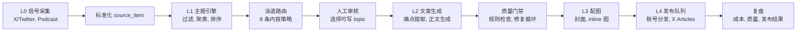

# Growth Engine Pipeline 产品化复盘

更新日期：2026-05-29  
阶段：作品集 case 草稿 v1  
定位：AI 内容增长工作流 / Agent-like Pipeline  
用途：作为 AI PM 求职作品集的第一优先级项目。  

## 一句话说明

Growth Engine Pipeline 是一个把 AI 领域信息流转成可发布文章的 AI 内容增长工作流。它覆盖信号采集、主题聚类、泳道路由、人工审核、文章生成、质量门禁、配图和发布队列。

这不是普通内容运营项目。它要证明的是：我能把一个开放任务拆成可配置、可审核、可复盘的 AI 工作流产品。

## 项目背景

AI 领域每天有大量新产品、模型、开源项目、播客和观点信号。人工处理这些信息会遇到几个问题：

| 问题 | 表现 |
|---|---|
| 信息源太散 | X/Twitter、Podcast、GitHub、产品页混在一起 |
| 选题不稳定 | 哪些信号值得写，靠临时判断 |
| 内容生产链路长 | 需要选题、找证据、写作、配图、发布 |
| 质量不可控 | LLM 容易生成空话、AI 句式、反问结尾、证据不足内容 |
| 无法复盘 | 如果没有运行记录，就不知道哪一步失败 |

因此这个项目的核心目标是：

> 把 AI 信号变成可审核、可生成、可发布、可复盘的内容生产任务。

## 用户和使用场景

| 用户 | 任务 |
|---|---|
| 内容增长操作者 | 从大量 AI 信号里找出值得写的主题 |
| AI 工具 / 自媒体账号运营者 | 持续产出高质量 AI 文章 |
| solo-op | 用较低人力成本维持选题、写作、配图、发布流程 |

## 系统架构

## 模块拆解

| 层级 | 模块 | 输入 | 输出 | 产品意义 |
|---|---|---|---|---|
| L0 | 信号采集 | X/Twitter、Podcast、外部 source item | 标准化 `source_item.json` | 把分散内容变成可处理数据 |
| L1 | 主题引擎 | source items | topic、排序、候选选题 | 判断哪些内容值得进入生产 |
| L1 | 泳道路由 | topic 特征 | T01-T08 内容泳道 | 把不同主题分配到对应内容策略 |
| Review | 人工审核 | 候选 topic | 放行写作的 topic | 保留 human-in-loop，避免盲目自动化 |
| L2 | 文章生成 | topic、来源、痛点 | 文章草稿 | 完成主体内容生产 |
| L2 | 质量门禁 | 文章草稿 | 通过/失败、修复版本 | 降低低质 LLM 输出 |
| L3 | 配图 | 文章结构、泳道风格 | 封面和 inline 图 | 让文章进入可发布状态 |
| L4 | 发布队列 | 成品文章、图片、账号 | 发布任务 | 连接内容生产和分发 |

## 关键设计

### 1. 信号标准化

系统从 X/Twitter、Podcast 等来源抓取内容，并把每条内容整理成统一的 `source_item.json`。

当前可引用证据：

| 证据 | 路径 / 数据 |
|---|---|
| dry run manifest | `projects/growth-engine-pipeline/runtime/runs/dry_run_20260328_184014/00_ingest/items/source_item_manifest.json` |
| dry run source item 数 | 854 |
| source family | official_x 36、article_x 86、post_x 732 |
| schema errors | 0 |

产品意义：

- 先解决输入标准化，再进入后续聚类和生成。
- 这说明项目不是只写 prompt，而是在处理真实数据流。

### 2. 主题聚类与排序

L1 主题引擎做四件事：过滤噪音、聚类主题、选择泳道、排序优先级。

当前策略配置：

| 策略项 | 当前配置 |
|---|---|
| `max_age_hours` | 168 |
| `require_canonical_url` | true |
| `min_text_words` | 25 |
| `min_topic_priority_for_write` | 38 |
| `max_signals_per_topic` | 12 |
| `cluster_similarity_threshold` | 2 |

topic priority 权重：

| 指标 | 权重 |
|---|---|
| volume_score | 0.35 |
| velocity_score | 0.25 |
| cross_source_resonance_score | 0.25 |
| novelty_score | 0.15 |

产品意义：

- 不是所有信号都进入写作。
- 系统先用规则过滤低质量输入，再判断主题是否值得写。
- 这个能力可迁移到 AI PM 的“任务分发、排序、策略配置”。

### 3. 内容泳道路由

系统定义 8 条内容泳道：

| 泳道 | 写作角度 | 典型用途 |
|---|---|---|
| T01 发布解读 | 新产品发布 -> 采用路径 -> 谁该用 | 新功能、新模型、新产品 |
| T02 信号解码 | 外部信号 -> 主论点 -> 判断 | 行业动态和趋势判断 |
| T03 结果证明 | ROI 数字 -> 证据链 -> 成本收益 | 增长案例和效率案例 |
| T04 纠偏逆转 | 失败 -> before/after -> 教训 | 复盘和避坑 |
| T05 对比筛选 | 多选项 -> 数据对比 -> 推荐 | 工具选型 |
| T06 能力交付 | 功能 -> 操作 -> 步骤清单 | 教程和方法 |
| T07 逆向观点 | 主流观点 -> 反驳 -> 重新定义 | 观点型内容 |
| T08 信号转行动 | 多信号 -> 判断窗口 -> 执行步骤 | 行动建议 |

产品意义：

- 同一个 AI 信号，不同写法对应不同用户价值。
- 泳道是内容策略的产品化表达，不是临时拍脑袋选题。

### 4. LLM 写作和质量门禁

L2 写作链路包括：

1. 数据补充：抓 GitHub 数据、产品页标题等非 LLM 信息。
2. 痛点提取：用 Haiku 提取读者痛点。
3. 文章生成：用 Sonnet 生成完整文章。
4. 质量门禁：用规则检测 12 类问题。
5. 修复循环：失败后最多 5 轮修复。
6. 格式化：输出 article blocks、source embed、结构化正文。

产品意义：

- 质量门禁说明项目有 evals 雏形。
- 修复循环说明项目不是“一次生成就结束”，而是有失败处理。
- 人工审核和发布确认说明它没有盲目追求全自动。

### 5. 配图和发布队列

L3 根据文章 section 和泳道风格生成封面与 inline 图。当前样本里已经存在：

| 证据 | 路径 |
|---|---|
| article image brief | `projects/growth-engine-pipeline/runtime/library/articles/article_x/20260325_article_x_e2e_dryrun/x-latentspacepod-e97939cef1c0/article_image_brief.json` |
| cover image asset | `projects/growth-engine-pipeline/runtime/library/articles/article_x/20260325_article_x_e2e_dryrun/x-latentspacepod-e97939cef1c0/image_assets/cover_01/result_1.png` |
| inline image assets | 同目录下 `inline_01` 到 `inline_03` 等 |

产品意义：

- 内容不是停在草稿，而是进入可发布资产状态。
- 这对 AI PM 面试很关键：能说明“从生成到交付”的完整链路。

## 当前运行证据

| 证据项 | 当前发现 |
|---|---|
| article library 生成时间 | 2026-03-20T07:21:00Z |
| article count | 35 |
| run count | 7 |
| requires human review count | 7 |
| dry run source item count | 854 |
| dry run schema errors | 0 |
| e2e dry run 样本 | `20260325_article_x_e2e_dryrun` |

可展示样本：

| 样本 | 路径 |
|---|---|
| 文章草稿 | `projects/growth-engine-pipeline/runtime/library/articles/article_x/20260325_article_x_e2e_dryrun/x-latentspacepod-e97939cef1c0/article_draft.md` |
| 配图 brief | `projects/growth-engine-pipeline/runtime/library/articles/article_x/20260325_article_x_e2e_dryrun/x-latentspacepod-e97939cef1c0/article_image_brief.json` |
| 图片资产 | `projects/growth-engine-pipeline/runtime/library/articles/article_x/20260325_article_x_e2e_dryrun/x-latentspacepod-e97939cef1c0/image_assets/` |

## AI PM 能力映射

| AI PM 能力 | Growth Engine 证据 |
|---|---|
| 任务拆解 | L0-L4 分层 pipeline |
| Agent 工作流 | 输入、路由、生成、质检、审核、发布 |
| Prompt / LLM 链路 | 痛点提取、文章生成、修复循环 |
| 工具调用 | RSS、fxtwitter、GitHub/product page 数据补充、图片生成、发布工具 |
| 评测意识 | 质量门禁、schema errors、requires human review |
| human-in-loop | 选题审核、发布确认、图片授权确认 |
| 产品增长 | 选题、内容生产、账号分发、复盘 |
| 数据结构 | source item、topic、article draft、image brief、publish queue |

## 可写进简历的表达

候选 bullet：

1. 设计 AI 内容增长 Pipeline，将 X/Twitter、Podcast 等多来源信号标准化为 source item，并通过主题聚类、泳道路由、人工审核、文章生成、质量门禁、配图和发布队列完成端到端内容生产。
2. 设计主题优先级和内容泳道路由规则，将 AI 信号分配到发布解读、信号解码、结果证明、对比筛选等 8 类内容策略，提升选题判断和内容产出稳定性。
3. 搭建 LLM 写作质量门禁与修复循环，对文章草稿进行规则检测和多轮修复，避免低质量 AI 句式、证据不足和格式问题直接进入发布环节。
4. 沉淀 Growth Engine SOP 与运行产物索引，形成从信号采集到发布队列的可复用 AI 工作流。

注意：这些 bullet 还需要根据“个人贡献边界”再压实，避免把 AI/Codex 协作实现写成完全独立工程实现。

## 面试讲法

### 30 秒版本

我做过一个 AI 内容增长 Pipeline，目标是把 AI 领域的分散信号变成可发布文章。系统先把 X/Twitter 和 Podcast 等来源标准化成 source item，再做主题聚类、泳道路由和排序；我保留人工审核节点，再进入 LLM 写作、质量门禁、配图和发布队列。这个项目最能证明我对 Agent / AI 工具产品的理解，因为它不是单次生成，而是完整任务流。

### 2 分钟版本

这个项目最开始要解决的是 AI 内容增长里的稳定性问题：每天信息很多，但人工筛选、写作、配图、发布都很难持续。我把任务拆成 L0 到 L4：L0 做信号采集和 source item 标准化，L1 做过滤、聚类、排序和 8 条内容泳道路由，人工审核后进入 L2 写作，L2 里有痛点提取、文章生成、质量门禁和修复循环，L3 负责配图，L4 进入发布队列。  

这个项目对我求 AI PM 的价值在于，它能说明我不是只会写 prompt，而是能设计输入、路由、审核、生成、评测和交付闭环。现在它还需要补的是更标准的成本报告、质量报告和失败样本沉淀。

## 待确认问题

| 问题 | 为什么必须确认 |
|---|---|
| 哪些模块是我主导设计，哪些是 AI/Codex 协作实现？ | 面试会追问个人贡献 |
| 哪些运行样本可以公开或脱敏展示？ | 作品集需要可展示证据 |
| 35 篇 article library 中哪些最终发布过？ | 需要区分生成结果和发布结果 |
| 质量门禁 12 类问题具体是什么？ | 这是 evals 能力的核心证据 |
| 运行成本、耗时、人工节省有没有记录？ | 影响增长/效率叙事 |
| 发布账号、队列、图片授权信息能否公开？ | 防止作品集暴露敏感信息 |

## 当前短板

| 短板 | 补法 |
|---|---|
| 成本和质量报告还不完整 | 给每次 run 生成 cost / quality summary |
| 失败样本没有系统沉淀 | 建 failure cases 表，把失败原因转成门禁规则 |
| runtime 产物太散 | 建轻量索引，不让作品集直接依赖整个 runtime |
| 个人贡献边界未写清 | 单独写 contribution statement |
| 结果指标还不够硬 | 补发布结果、阅读/互动、节省时间等数据 |

## 下一步

1. 从 `20260325_article_x_e2e_dryrun` 选一个样本做完整链路展示。
2. 补一张更适合展示的架构图，可以从本文 mermaid 改成图片。
3. 梳理质量门禁 12 类问题。
4. 写个人贡献边界。
5. 如果能公开发布结果，再补“生成 -> 发布 -> 反馈”的最终闭环。
