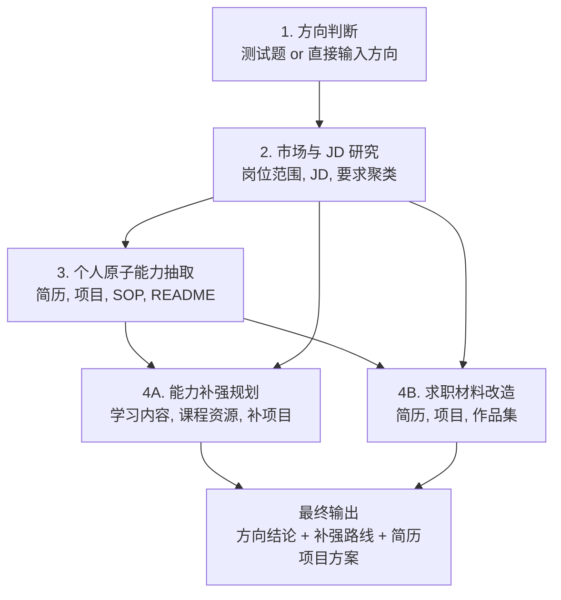

# 未来规划求职 Skill 草案

更新日期：2026-05-29  
阶段：Skill spec v1  
目标：把“未来方向选择 + 求职市场研究 + 个人能力画像 + 补强规划 + 简历项目改造”做成一套可复用工作流。  
Skill 草案：[skill-drafts/future-career-job-search/SKILL.md](skill-drafts/future-career-job-search/SKILL.md)

## Skill 定位

这个 Skill 不只是帮用户改简历。它要先判断用户适合什么方向，再用真实岗位要求反推能力缺口，最后同时给出两类方案：

1. 能力补强方案：学什么、用什么课程、做什么项目。
2. 求职材料改造方案：简历怎么改、项目怎么补、作品集怎么组织。

## 触发场景

用户提出以下需求时使用：

- 不确定自己适合什么工作方向。
- 已经有目标方向，但不知道岗位真实要求。
- 想基于简历和项目经历做求职规划。
- 想知道要补什么技能、课程、项目。
- 想把已有项目包装成更适合目标岗位的简历/作品集。

## 总流程



## Step 1：方向判断

### 两种入口

| 入口 | 适用情况 | 处理方式 |
|---|---|---|
| 测试题判断 | 用户不知道自己适合什么方向 | 先做方向诊断，再给候选方向排序 |
| 直接输入方向 | 用户已经明确方向 | 不做泛测试，直接进入岗位市场研究 |

### 测试题要判断什么

测试题不是性格测试。它要判断的是求职方向匹配度。

| 维度 | 要判断的问题 |
|---|---|
| 兴趣 | 用户愿不愿意长期研究这个领域的问题 |
| 能力基础 | 用户已有经历能否迁移到该岗位 |
| 学习成本 | 用户需要补多少硬技能 |
| 作品集可行性 | 4-8 周能不能做出能展示的项目 |
| 市场机会 | 这个方向是否有足够岗位 |
| 风险 | 是否学历、经验、技术门槛过高 |

### 输出文件

`career-direction-diagnosis.md`

内容：

- 候选方向列表。
- 每个方向的匹配度评分。
- 推荐主线 / 副线 / 暂不建议方向。
- 为什么推荐，不只给结论。
- 如果用户直接输入方向，则记录“用户指定方向”，不强行重开方向选择。

## Step 2：全网获取岗位范围 + JD

### 目标

根据方向找出真实岗位，而不是靠抽象分类想象岗位。

### 信息来源优先级

| 优先级 | 来源 | 用法 |
|---|---|---|
| S | 公司官网招聘页 | 优先使用，作为最可信 JD 来源 |
| A | Boss 直聘、猎聘、脉脉、LinkedIn | 补充岗位语言和真实要求 |
| B | Anysearch / 搜索引擎 / 聚合页 | 官网找不到时使用 |
| C | 文章、经验帖、培训广告 | 只能做背景参考，不当作 JD 证据 |

### 必须产出

| 文件 | 内容 |
|---|---|
| `target-company-role-map.md` | 目标公司、岗位族、招聘入口、城市、优先级 |
| `jd-corpus.md` | 按公司保存 JD 原文摘要、链接、来源、抓取日期 |
| `role-coverage-index.md` | 这个方向覆盖哪些岗位类型 |
| `jd-requirement-frequency.md` | 明确要求的聚类和频次排序 |
| `project-requirement-index.md` | JD 中明确提到的项目/作品集要求 |

### 聚类规则

只统计 JD 中明确写出的要求，不把岗位标题当能力要求。

能力要求建议聚类为：

- 行业 / 用户 / 场景理解。
- 产品规划 / 需求分析 / 交互体验。
- 数据分析 / 指标 / 实验。
- AI / LLM / Agent / RAG / Prompt。
- 工程理解 / API / 数据结构 / SQL / Python。
- 评测 / 质量 / 安全 / 风险控制。
- 增长 / 内容 / 商业化。
- 沟通协作 / 项目推进。
- 学历 / 年限 / 实习限制。

### 真实性要求

- 所有岗位信息必须带来源链接和抓取日期。
- 官网优先；聚合页必须标注可信度。
- 找不到就写“没查到”，不能编 URL。
- 岗位数量不足时，要明确说样本少，不把样本当全市场。

## Step 3：提取用户原子能力

### 输入

| 输入 | 说明 |
|---|---|
| 简历 | docx / pdf / md 均可 |
| 项目目录 | 用户指出项目位置 |
| README / SOP | 优先读这些高信号文件 |
| 运行产物 | 数据、截图、日志、demo、发布结果 |
| 用户补充 | 个人贡献边界、不能公开的信息 |

### 原子能力定义

原子能力 = 用户在某个具体场景里做过的可证明动作。

格式：

```text
能力 = 动作 + 场景 + 方法/工具 + 结果/证据
```

例子：

```text
通过 GSC / GA4 / Looker 搭建 SEO 数据监控，跟踪 query impression、session、注册等指标，用于判断内容和外链动作是否有效。
```

### 输出文件

`user-atomic-ability-map.md`

内容：

- 用户项目清单。
- 每个项目的原子能力。
- 每个能力对应的证据。
- 证据强度：强 / 中 / 弱。
- 是否适合写简历。
- 是否需要补公开材料。

### 抽取规则

- 优先抽“近期真实项目”。
- 旧经历作为能力素材，不默认当主卖点。
- 不夸大 AI 参与度。
- 不把 AI/Codex 协作写成完全独立工程实现。
- 不复制隐私信息。

## Step 4A：能力补强规划

### 目标

把岗位要求和用户能力做差距分析，然后给出学习内容和项目补强路线。

### 输出文件

`ability-gap-learning-roadmap.md`

内容：

| 模块 | 要回答的问题 |
|---|---|
| 核心缺口 | 哪些能力是岗位高频要求但用户证据不足 |
| 学习内容 | 每个缺口要学什么 |
| 课程资源 | 直接给课程、文档、教程链接 |
| 补强项目 | 做什么项目最能证明能力 |
| 产出标准 | 学完/做完后要留下什么证据 |
| 时间安排 | 4-8 周优先级 |

### 课程资源规则

- 必须搜索当前可访问资源，不能凭记忆给过期课程。
- 优先官方文档、大学公开课、平台高质量课程、开源教程。
- 每个资源要说明用途：补基础、补项目、补面试表达。
- 不给泛泛关键词，如“去学机器学习”。

### 项目补强规则

每个补强项目必须服务求职，不做纯兴趣项目。

项目描述必须包含：

- 目标岗位能力。
- 用户任务。
- 数据来源。
- 核心功能。
- 技术/工具。
- 评测方式。
- 作品集展示形式。

## Step 4B：求职材料改造

### 目标

根据岗位方向和 JD 要求，对用户现有简历、项目、作品集做改造。

### 输出文件

`resume-project-rewrite-plan.md`

内容：

| 模块 | 要做什么 |
|---|---|
| 简历主叙事 | 一句话定位、目标岗位、项目排序 |
| 项目取舍 | 哪些放前面，哪些压缩，哪些不写 |
| bullet 改写 | 每段经历如何写成岗位语言 |
| 项目补证据 | 哪些项目要补图、数据、demo、README |
| 面试故事 | 每个主项目准备 30 秒 / 2 分钟讲法 |
| 风险提示 | 哪些表述容易被追问或质疑 |

### 两版方案

4A 和 4B 必须同时输出，不能只给学习计划，也不能只改简历。

| 方案 | 关注点 | 输出 |
|---|---|---|
| A：能力补强方案 | 用户还缺什么 | 学习路线、课程资源、补强项目 |
| B：材料改造方案 | 用户已有材料怎么投 | 简历结构、项目排序、bullet、作品集 |

## Step 5：整合最终求职计划

### 输出文件

`career-action-plan.md`

内容：

1. 目标方向。
2. 目标岗位范围。
3. 目标公司列表。
4. 岗位核心要求。
5. 用户原子能力画像。
6. 能力缺口。
7. 4-8 周补强路线。
8. 简历/项目改造路线。
9. 投递优先级。
10. 下次复盘节点。

## 工作流边界

### 不做

- 不一上来改简历。
- 不在没有 JD 的情况下给学习清单。
- 不用泛职业测试替代真实岗位研究。
- 不把旧项目强行包装成当前能力。
- 不编造岗位链接、课程链接、公司招聘信息。
- 不把小样本 JD 当全市场。

### 必须做

- 先确定方向，再查岗位。
- 先拿真实 JD，再聚类能力。
- 先抽用户原子能力，再做差距分析。
- 学习计划和简历改造同时给。
- 每个建议都尽量落到可执行产出。

## 当前 AI PM 项目中的对应关系

| Skill 步骤 | 当前已有文件 | 还缺什么 |
|---|---|---|
| Step 1 方向判断 | `ai-pm-direction-choice.md`、`ai-pm-target-positioning.md` | 可复用测试题 |
| Step 2 JD 研究 | `ai-pm-target-company-map.md`、`ai-pm-jd-materials.md`、`ai-pm-jd-requirement-frequency.md` | 更完整的官网 JD refresh |
| Step 3 原子能力 | `ai-pm-experience-profile.md`、`ai-pm-ability-material-gap-analysis.md` | 原子能力表 |
| Step 4A 补强规划 | `ability-gap-learning-roadmap.md` | 后续可继续细化课程进度和项目验收 |
| Step 4B 材料改造 | `resume-project-rewrite-plan.md` | 后续可继续写最终简历文本 |
| Step 5 行动计划 | 暂无独立文件 | 4-8 周求职行动计划 |

## 下一步

先做第一个缺口：

> `career-direction-diagnostic-test.md`

内容包括：

- 方向测试题。
- 评分维度。
- 如果用户已指定方向，如何跳过测试。
- 输出格式：主线、候选副线、暂不建议方向。
